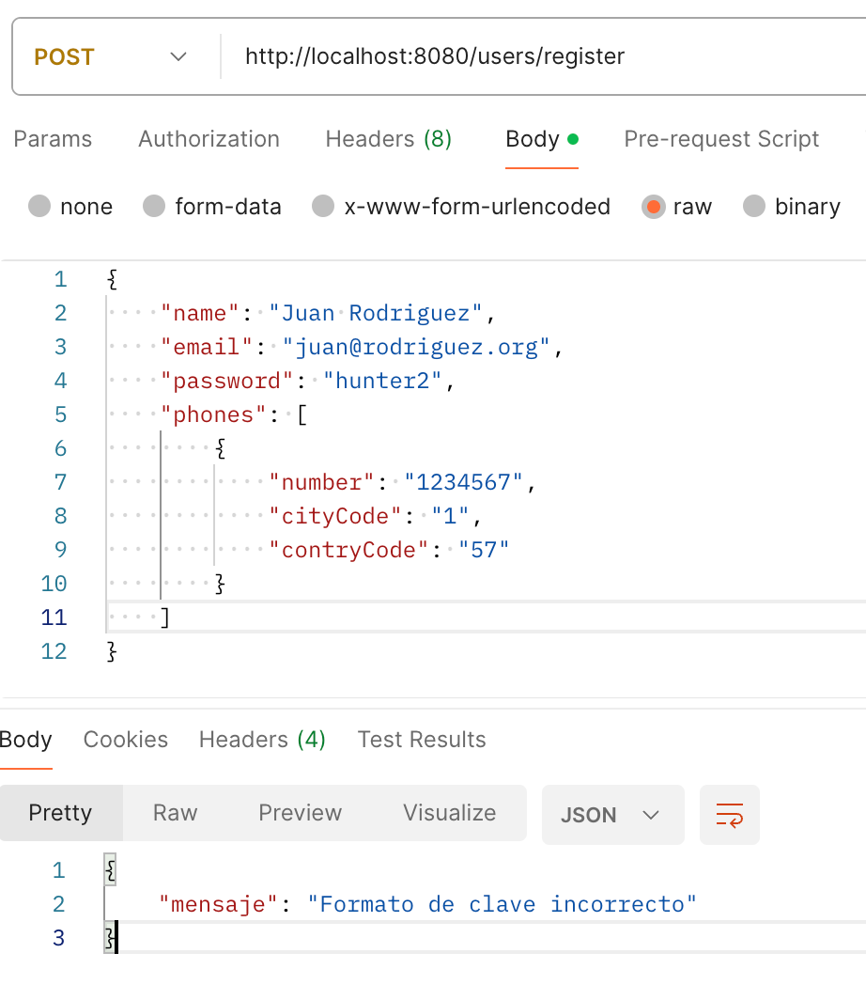
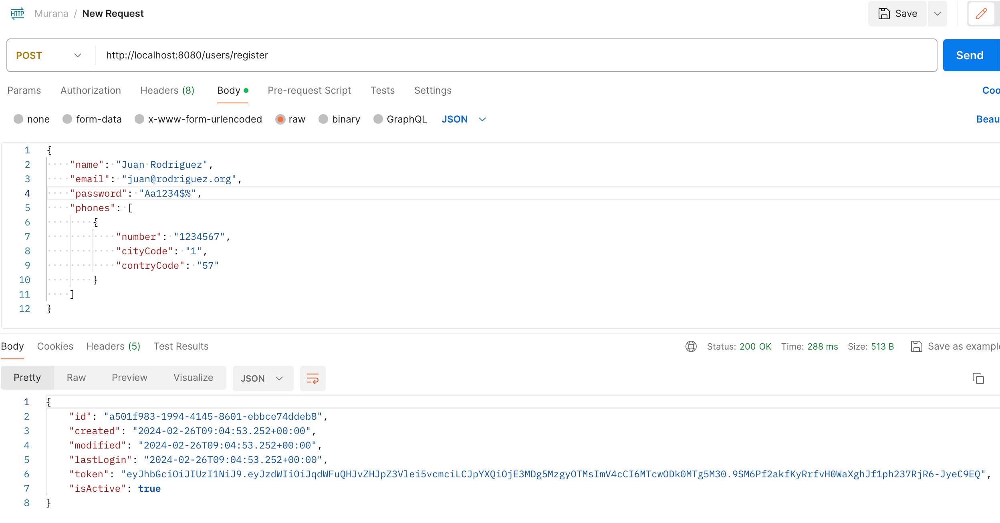
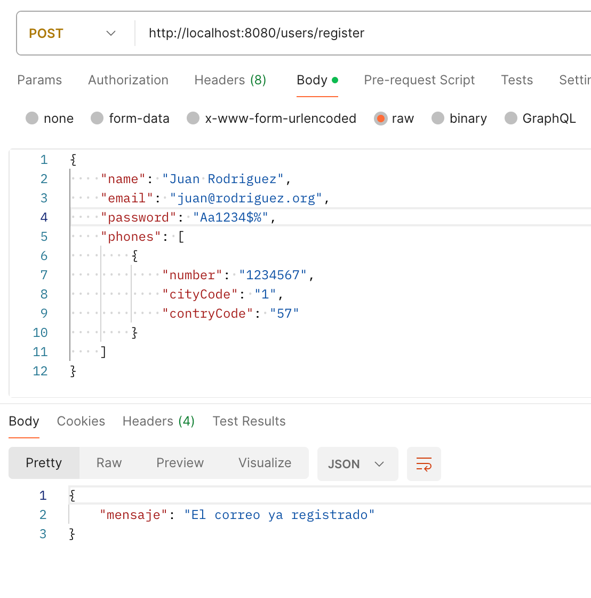

# Proyecto Spring Boot con JWT

## Cómo probar el servicio

1. Inicia la aplicación Spring Boot.
   `mvn spring-boot:run`
2. Accede a la documentación de la API en `http://localhost:8080/swagger-ui/index.html`.
3. Utiliza las operaciones disponibles en Swagger UI para probar el servicio.

### Registro de usuario

- Endpoint: `/api/users/register`
- Método: POST
- Body:
```json
{
  "name": "Nombre de Usuario",
  "email": "usuario@example.com",
  "password": "ContraseñaSegura123!",
  "phones": [
    {
      "number": "123456789",
      "citycode": "1",
      "countrycode": "57"
    }
  ]
}
```
### Ejemplo de manejo de error



### Ejemplo de respuesta correcta



### Ejecutar nuevamente para confirmar que el usuario ya ha sido creado



### Diagrama de la solución

```mermaid
graph TD;
    Cliente-->Controlador;
    Controlador-->Servicio;
    Servicio-->Repositorio;
    Repositorio-->BD[Base de Datos];
    Servicio-->JWT;
    JWT-->Controlador;
    Controlador-->Cliente;

    classDef default fill:#f9f,stroke:#333,stroke-width:4px;
    class Controlador,Servicio,Repositorio,JWT default